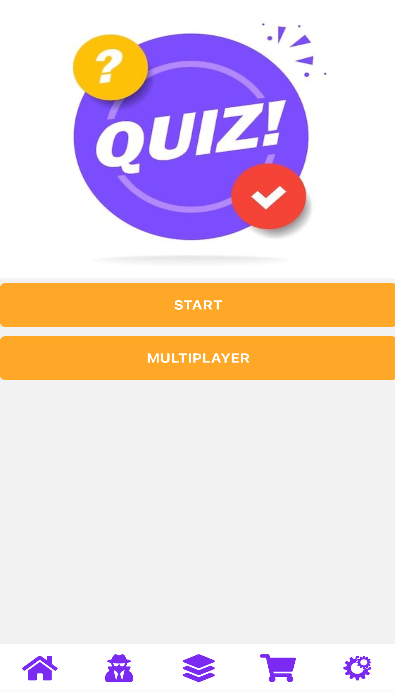

# QuizApp AWS

## Description

Bienvenue dans QuizApp AWS, une application de quiz développée avec React Native et intégrant des services AWS tels qu'Amplify pour l'authentification.

## Comment démarrer

Assurez-vous d'avoir [Node.js](https://nodejs.org/) installé.

1. Clonez le dépôt:

   ```bash
   git clone <lien-du-depot>
   cd quizapp-aws

## Installez les dépendances

npm install

## Lancez l'application

npx expo start

## Technologies Utilisées

React Native
AWS Amplify
AWS Cognito
Expo

## Fonctionnalités

Quiz dans différentes catégories.
Authentification utilisateur avec AWS Cognito.
Catégories spéciales débloquables avec des points d'utilisateur.

## Captures d'écran

<div align="center">


</div>

<p align="center">
  

  

  

  
</p>